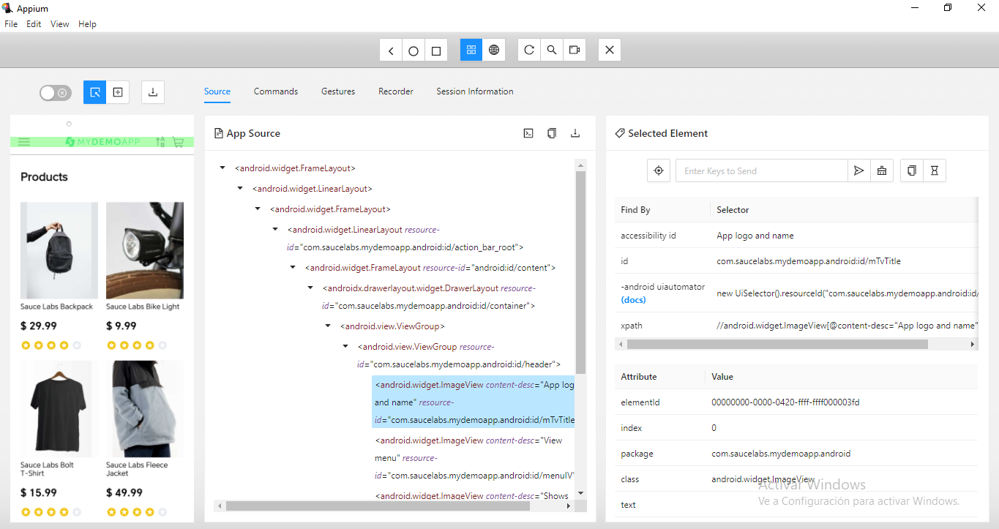
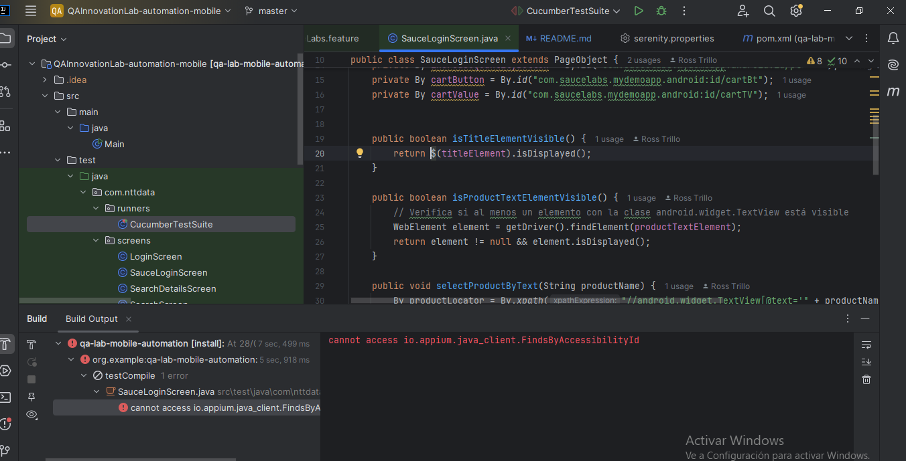

# Proyecto de Automatización de Pruebas para Aplicación Móvil

## Descripción

Este proyecto utiliza el framework proporcionado durante la sesión de clase para automatizar las pruebas de regresión de una aplicación en Android para una tienda en línea. El objetivo principal es identificar y detectar comportamientos no deseados en la aplicación.

## Requisitos

Para ejecutar las pruebas automatizadas, asegúrate de tener lo siguiente:

1. **Appium**:

2. **Appium Inspector**

3. **APK de la Aplicación**:
    - [APK de Sauce Labs](https://github.com/saucelabs/my-demo-app-android/releases/download/2.0.2/mda-2.0.2-23.apk)

4. **Dispositivo Android**: Asegúrate de que el dispositivo esté conectado y reconocido por `adb`. Puedes verificarlo con:
   ```bash
   adb devices

## Configuración de Appium Inspector



## Estructura de Pruebas

El proyecto incluye pruebas automatizadas para la funcionalidad del carrito de compras en la aplicación. Las pruebas están configuradas para validar lo siguiente:

- **Carga de la Aplicación**: Verifica que la aplicación se cargue correctamente.
- **Agregar Productos**: Añade productos al carrito según los datos proporcionados en los ejemplos.
- **Validación del Carrito**: Verifica que el carrito de compras se actualice correctamente después de agregar productos.


# Archivos del Proyecto

1. **`SauceLabsStepDef.java`**
    - Definición de los pasos de prueba en Cucumber. Contiene las implementaciones de los pasos `Given`, `When`, y `Then` para los escenarios del archivo de características.

2. **`SauceLabsLoginSteps.java`**
    - Implementación de los pasos específicos relacionados con el inicio de sesión en la aplicación. Interactúa con la pantalla de inicio de sesión para realizar acciones y validaciones.

3. **`SauceLoginScreen.java`**
    - Clase que representa la pantalla de inicio de sesión en la aplicación. Contiene métodos para interactuar y verificar la visibilidad de elementos en la pantalla.

4. **`feature_file.feature`**
    - Archivo de características de Cucumber que define los escenarios de prueba en formato Gherkin. Incluye los casos de prueba para validar la funcionalidad del carrito de compras en la aplicación.


## Problemas Conocidos

Se encuentró el error `cannot access io.appium.java_client.FindsByAccessibilityId`, las dependecias pueden estar no bien actualizadas o mal configuradas.



